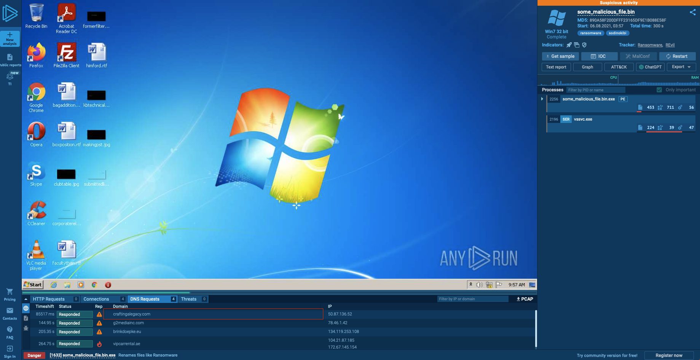
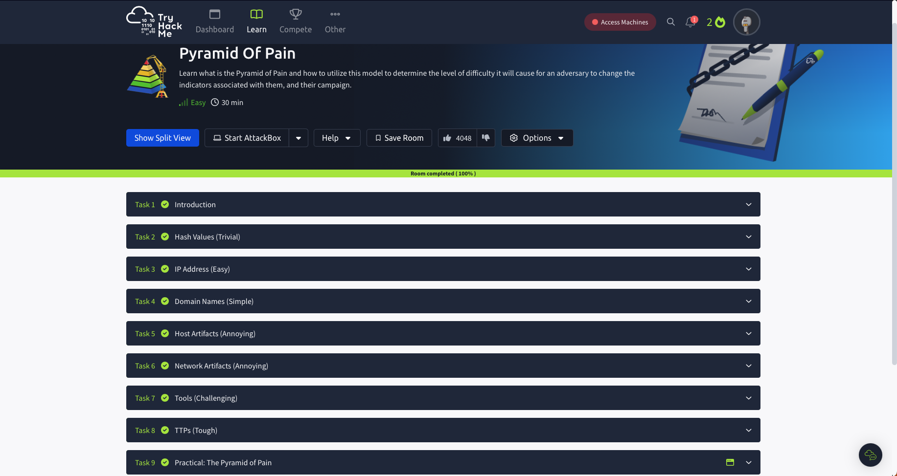

# The-Pyramid-of-Pain
I completed the Pyramid of Pain course on TryHackMe and am excited to document my journey. The Pyramid of Pain is a model used in cybersecurity to explain the increasing difficulty for attackers as defenders use various types of indicators to detect or stop an attack. The higher up the pyramid, the harder it becomes for attackers to adjust their tactics and continue their operations. At the base of the pyramid are simple indicators like file hashes, IP addresses, and domain names, which attackers can easily change. As you move up the pyramid, the indicators become more complex, such as host artifacts, network artifacts, and tools, making it progressively harder for attackers to adapt. At the top of the pyramid are advanced tactics, techniques, and procedures (TTPs), which require significant effort for attackers to modify.

## Pyramid of Pain Diagram

## Task2 File Name

## Task2 Correct Answer

## Task3 IP

## Task3 Correct Answer

## Task4 Suspicious Domain Name

## Task4 Shortened URL

## Task4 Correct Answer

## Task5 regidle.exeIP

## Task5 Malicious Executable

## Task5 VirusTotal

## Task5 Correct Answer

## Task6 User-Agent

## Task6 Post Request

## Task6 Correct answer

## Task7 Method

## Task7 Alternative Name

## Task7 Correct Answer

## Task8 Technique

## Task8 Chimera

## Task8 Correct Answer

## Task9 Flag

## Task9 Correct Answer

## Pyramid of Pain Complete

